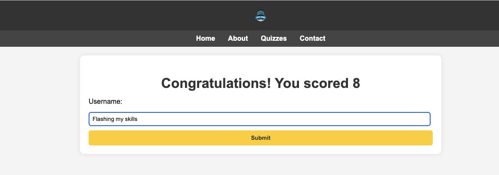

# **[Alaska Quiz Team](https://jacquesiversen.github.io/REDO-PP2/)**

This project came together to accommodate an understanding in JavaScript language. Alot of the methodology is used similar to React, but without the smart features that might add. This site follows a fictional quiz community in Alaska, however they are not very active, as they only have one current quiz available.

# 

- Deployed website **[Here](https://jacquesiversen.github.io/REDO-PP2/)**

## Contents

- **[Development Process](#development-process)**
- **[Design](#design)**
  - **[Typography](#typography)**
  - **[ColorScheme](#colorscheme)**
  - **[Features for the future](#features-future)**
- **[Testing](#testing)**
- **[Deployment](#deployment)**
- **[Technologies used](#technologies-used)**
- **[Credits](#credits)**

## [Development Process](#development-process)

It is the idea to create a simple site with minimal design to lay focus on the task that is javascript funtionality instead. This application attempts to have a simple funtionality to allow for easy scaleabilty.
In this release, one quiz only is available to try. The highscore element showcase multiple fictional/dummy scores to quizzes who arent designed yet.

The build is following agile workflow, but without any written tickets or classifications. The project follow the MOSCOW model with following requirements (not userstories)

- The site Must feature a navbar
- The site Must feature a footer
- The site Must feature a quiz with at least 4 questions
- The site Must feature a highscore/total score element
- The site Should contain a landing/index page with welcoming information
- The site Should contain a highscore for users to type in their username with their score.
- The site Could contain an about page
- The site Could contain a dummy contact form
- The site Could contain multiple quizzes
- The site Could contain a DIY quizbuilder
- The site Wont contain a working Contact form
- The site Wont contain any user authentication

## [Design](#design)

The design for this website is very simple, hence why no additional font is chosen, nor are any progressive colorschemes used.

### The design showcases following:

- **[Landingpage / Indexpage](#LP)**
  - **[Navbar](#NB)**
  - **[Footer](#footer)**
- **[About Page](#about)**
- **[Contact Form](#contact)**
  - **[Contact Success](#contact-success)**
- **[Quizzing Page / Quizlist](#quizpage)**
  - **[Start Quiz](#startquiz)**
  - **[End of Quiz](#endquiz)**
  - **[Highscore](#highscore)**

### [Landingpage / Indexpage](#LP)

On this page, users are met with a greeting, a responsive heroimage to set the mood, and a small telling about who the quiz team are. Navbar and footer are fixed.

# 

### [Navbar](#NB)

With a small logo of own design on top, the Navbar features 4 options:

- Home
- About
- Quizzes
- Contact
  The navbar is generic, and is visable on all pages/sites. On smaller screens, options will stack on top of one another.

# 

### [Footer](#footer)

The footer contains 3 links, for facebook, twitter and instagram, along with their respective favicon. The link will take you to their homepage opening in another window.

# 

### [About Page](#about)

In the about page, users can read some generated text regaring a fictional quiz team who is the pride & joy of alaska.

# 

### [Contact Form](#contact)

The contact page is designed only to provide users with some interactivity that is not readable. The contact form is merely dummy, and will not store, send or cause any effect. Users are though required to list out all input fields inorder to proceed. When sending a furfilled form, users will be taken to the success page, which is just a single sentence verifying their submission.

# 

- Success Page

# 

### [Quizzing Page / Quizlist](#quizpage)

# 

Users are met with the current quizzes in the top, highscores for each individual quiz beneath. Alaska Geography is the only active quiz, and will show scores loaded from localstorage, alongside 3 dummy scores to furfill, if none are present. Hovering effect are added only to Quiz Names, to provide users some interactivity and CTA.

When accessing The 2 quizzes, users will be redirected to notfound page:
The page not found have one option, to contact the administrators to provide ideas. Clicking the "here" link will take you to the contact form.

# 

### [Start Quiz](#startquiz)

In quiz, starting from the top, users will underneath the title of the quiz have a progress bar, which is both a graphic and percentage. Beneath, they'll see a picture to amplify the question, the question beneath that, and 3 options.

Features of this page:

- Inactive next button, user cant progress without pressing a radio button.
- Inactive Back button, only on page 1. If users are progressing midquiz, their previous answer will be autofurfilled in the question which they'll return.
- Colorscheme is similar to rest of page, light grey and yellow.

# 

### [End of Quiz](#endquiz)

When completing all questions 8 in this quiz, users will be taken to the submit highscore to then be redirected to the highscore/quiz page once again. And if their score made the top to, will then be displayed.

# 

### [Highscore](#highscore)

In the highscore elements, users will find 3 highscores atm. with the only for Alaska Geography at the top, only displaying top 10. In this readme example, localstorage in not cleared, and a score of 34 is at the top, due to an increment error in js, this error is solcved.

# 

### [Typography](#typography)

No changes were made here:

### [ColorScheme](#colorscheme)

Following colors were used and browsed from react bootstrap library.

- Body - background-color: #f4f4f4;, content: background-color: #fff;
- Header: background-color: #333;
- Nav - background-color: #444; Hovering color: #ffcc00;
- Footer: background-color: #333;, Hovering color: #ffcc00;
- Button: background-color: #ffcc00; hovering: background-color: #ffe066;

### [Features for the future](#features-future)

Ideas to implement in the future:

- More options on landing page:
  - Quiz Highscore, with linking to quiz.
  - Link direct to contact
  - References
- Apealing design on About page
- Horizontal responsiveness in nav, footer elements
- Collapse button on footer (responsiveness)
- In Quiz:
  - Perhaps a right/wrong option.
  - Have question horizontal centered in smaller screens.
  - A Hint function
- Highscore could have a interactive greeting, depending on your score.
- Contact form linked to mailservice

## [Testing](#testing)

- Manual Testing:

Click here for [Testing File](Testing.md)

Tools for testing:

- Chrome Devtools:
- AI for validation
- Validate Javascript
- CSS Validator

## [Deployment](#deployment)

The steps to deploy is as follows:

git add <file> - This command was used to add the file(s) to the staging area before they are committed.

git commit -m “commit message” - This command was used to commit changes to the local repository queue ready for the final step.

git push - This command was used to push all committed code to the remote repository on github.

Deployment to Github Pages

- The site was deployed to GitHub pages. The steps to deploy are as follows:
- In the GitHub repository, navigate to the Settings tab
- From the menu on left select 'Pages'
- From the source section drop-down menu, select the Branch: main
- Click 'Save'
- A live link will be displayed in a green banner when published successfully.

### Issues/Bugs on deplyment

When deploying this, links and Href's in the files were not compiling.
Backslash (/) were removed before link ex. /index.html. Same issue went for links to assets files. This was removed and tested.

## [Technologies used](#technologies-used)

- HTML: The structure is devoloped using HTML as main language.
- CSS: Site is styled from custom CSS in one single external file.
- Javascript: Game logic and statements created using Js in external files.
- VS Code editor: Whole site is devolved in Visual Studio Code IDE.
- GIT & GitHub: Committed and pushed through Git to Github and deployed through Pages.

## [Credits](#credits)

- Multiple google searches for implemented code solutions.
- StackOveflow
- React documentation for logic.
- Bootstrap documentation for container and style design ideas.
- Canva, Logo maker.
- W3 Schools.
- Youtube, Netninja was used for setting up file structure.
