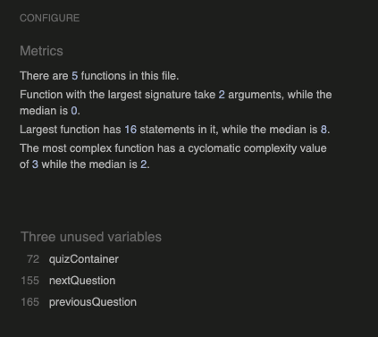
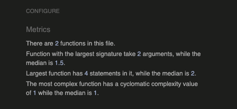
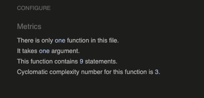

## Manual Testing

- Click here to return to the [Read Me](README.md)

- A series of manual tests were carried out to verify that all functionalities performed as intended. Below are the test cases.

- W3C Validator used for all .html files. If error, error will be listed in testcase under bugs:
- Jigsaw CSS Validator, no errors found.
- JS Validator (Jshint)

# 

    - script.js

# 

    - highscore.js

# 

    - score.js

## Index Page / Home Page

**Test Case Description:** Verify all features of the page:

**Test Steps:**

1. Navbar is visible with 4 options: Home, About, Quizzes & Contact == pass
2. Check if the navbar logo is displayed. == pass
3. Check if all nav links are working. == pass
4. Navbar is responsive == pass
5. Content is rendered == pass
6. Content is responsive == pass
7. Footer is rendered == pass
8. Footer is responsive == pass
9. Footer Links are rendered == pass
10. Footer Links are Working == pass

**Expected Result:**
All links should take you to their respective endpoint. Page should be responsive down to 200px

**Result:** Passed

## About page

**Test Case Description:** Verify all features of the page:

**Test Steps:**

1. Navbar is visible with 4 options: Home, About, Quizzes & Contact == pass
2. Check if the navbar logo is displayed. == pass
3. Check if all nav links are working. == pass
4. Navbar is responsive == pass
5. Content is rendered == pass
6. Content is responsive == pass
7. Footer is rendered == pass
8. Footer is responsive == pass
9. Footer Links are rendered == pass
10. Footer Links are Working == pass

**Expected Result:**
All links should take you to their respective endpoint. Page should be responsive down to 200px

**Result:** Passed

## Contact Page & Contact Success

**Test Case Description:** Verify all features of the page:

**Test Steps:**

1. Navbar is visible with 4 options: Home, About, Quizzes & Contact == pass
2. Check if the navbar logo is displayed. == pass
3. Check if all nav links are working. == pass
4. Navbar is responsive == pass
5. Content is rendered == pass
6. Content is responsive == pass
7. Button functionality working == pass
8. User should not be able to submit on empty information == pass
9. User should be redirected on form submission success == pass
10. Footer is rendered == pass
11. Footer is responsive == pass
12. Footer Links are rendered == pass
13. Footer Links are Working == pass

**Expected Result:**
User will be redirected on formsubmission, only if all imputs filled.
All links should take you to their respective endpoint. Page should be responsive down to 200px

**Bugs:**

- W3C Validator, error in Form on Aria-label, solved == removed.
- W3C Validator (contactsuccess) button inside a changed to a inside button

**Result:** Passed

## Quizpage and Highscore

**Test Case Description:** Verify all features of the page:

**Test Steps:**

1. Navbar is visible with 4 options: Home, About, Quizzes & Contact == pass
2. Check if the navbar logo is displayed. == pass
3. Check if all nav links are working. == pass
4. Navbar is responsive == pass
5. Content is rendered == pass
6. Content is responsive == pass
7. All highscores displayed == pass
8. Only 10 best highscore values displayed == pass
9. Interactive QuizButtons working and linking == pass
10. Footer is rendered == pass
11. Footer is responsive == pass
12. Footer Links are rendered == pass
13. Footer Links are Working == pass

**Expected Result:**
Highscore for 3 quizzes shown. Highscore for Alaska Geography show only top 10.
Interactive buttons on quiz names.
All links should take you to their respective endpoint. Page should be responsive down to 200px

**Result:** Passed

## Notfound page

**Test Case Description:** Verify all features of the page:

**Test Steps:**

1. Navbar is visible with 4 options: Home, About, Quizzes & Contact == pass
2. Check if the navbar logo is displayed. == pass
3. Check if all nav links are working. == pass
4. Navbar is responsive == pass
5. Content is rendered == pass
6. Content is responsive == pass
7. Links are working == pass
8. Footer is rendered == pass
9. Footer is responsive == pass
10. Footer Links are rendered == pass
11. Footer Links are Working == pass

**Expected Result:**
All links should take you to their respective endpoint. Page should be responsive down to 200px

Bugs: Resposiveness not satisfied, text size changed.

**Result:** Passed

## In Quiz

**Test Case Description:** Verify all features of the page:

**Test Steps:**

1. Navbar is visible with 4 options: Home, About, Quizzes & Contact == pass
2. Check if the navbar logo is displayed. == pass
3. Check if all nav links are working. == pass
4. Navbar is responsive == pass
5. Content is rendered == pass
6. Content is responsive == pass
7. Progress bar is visible and working == pass
8. Percentage is shown and correct == pass
9. Img is displayed == pass
10. Question is displayed == pass
11. 3 options are displayed == pass
12. User can only choose 1 option == pass
13. Back button inactive on first question == pass
14. Back button is working, when past Q1 == pass
15. Next button inactive on option not entered == pass
16. Next button is working, when option entered == pass
17. On last question, user should be redirected to score == pass
18. Footer is rendered == pass
19. Footer is responsive == pass
20. Footer Links are rendered == pass
21. Footer Links are Working == pass

**Expected Result:**
User should be able to do the quiz, without ending in a crash.
All pictures should render accordingly.
All links should take you to their respective endpoint. Page should be responsive down to 200px

**Result:** Passed

## Score

**Test Case Description:** Verify all features of the page:

**Test Steps:**

1. Navbar is visible with 4 options: Home, About, Quizzes & Contact == pass
2. Check if the navbar logo is displayed. == pass
3. Check if all nav links are working. == pass
4. Navbar is responsive == pass
5. Content is rendered == pass
6. Content is responsive == pass
7. Correct answers are calculated and displayed == pass
8. On form submission, username and score should be stored in localstorage == pass
9. On submission, user will be redirected to quiz/highscore page with their score displayed if high enough == pass
10. Footer is rendered == pass
11. Footer is responsive == pass
12. Footer Links are rendered == pass
13. Footer Links are Working == pass

**Expected Result:**
All links should take you to their respective endpoint. Page should be responsive down to 200px

**Bugs:** Resposiveness not satisfied, text size changed.

**Result:** Passed
